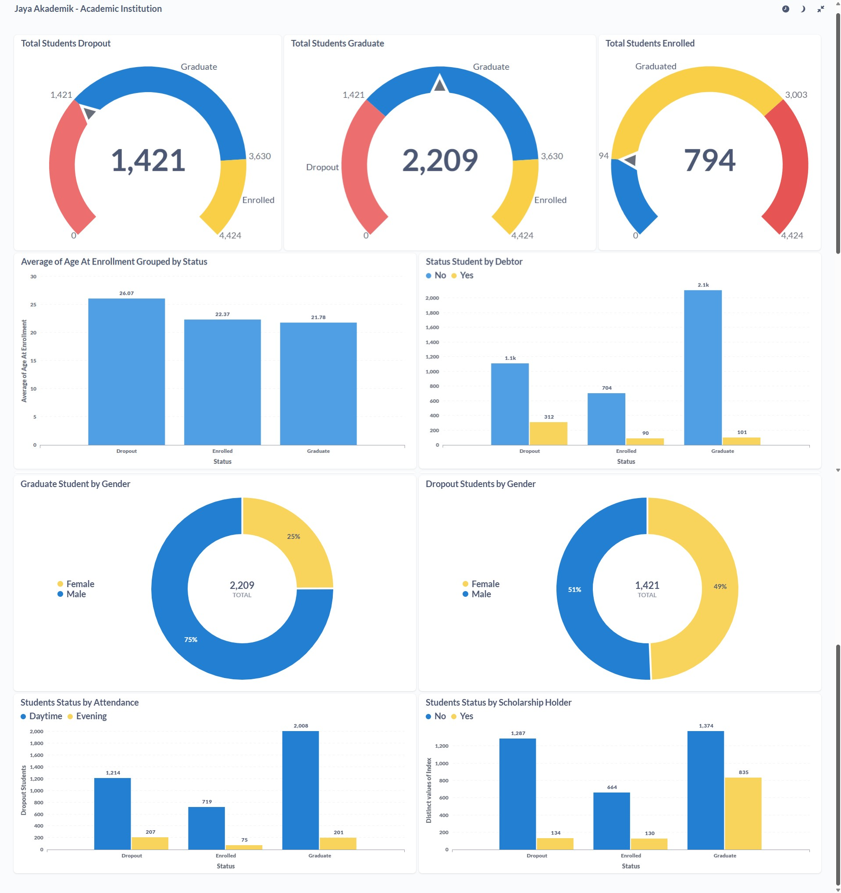

# Proyek Akhir: Menyelesaikan Permasalahan Perusahaan Edutech

## Business Understanding
Jaya Jaya Institut merupakan salah satu institusi pendidikan perguruan yang telah berdiri sejak tahun 2000. Hingga saat ini ia telah mencetak banyak lulusan dengan reputasi yang sangat baik. Akan tetapi, terdapat banyak juga siswa yang tidak menyelesaikan pendidikannya alias dropout.

Jumlah dropout yang tinggi ini tentunya menjadi salah satu masalah yang besar untuk sebuah institusi pendidikan. Oleh karena itu, Jaya Jaya Institut ingin mendeteksi secepat mungkin siswa yang mungkin akan melakukan dropout sehingga dapat diberi bimbingan khusus.

### Permasalahan Bisnis
1. Mengidentifikasi siswa yang berpotensi melakukan dropout

### Cakupan Proyek
Proyek ini mencakup beberapa tahapan seperti :
1. Pengumpulan dan pembersihan data dari dataset Jaya Jaya Institut
2. Pengembangan model machine learning untuk mendeteksi siswa yang berpotensi melakukan dropout
3. Pembuatan business dashboard untuk memantau perkembangan siswa
4. Pembuatan web untuk menggunakan sistem machine learning

### Persiapan

Sumber data: [Dataset Jaya Jaya Institut][https://github.com/dicodingacademy/dicoding_dataset/tree/main/students_performance]

Setup environment:

### 1. Setup Notebook :
- Setup Pip
```
pip install virtualenv
```
- Create a Virtual Environment
```
cd my-project
virtualenv --python C:\Path\To\Python\python.exe venv
```
- Activate The Environment
```
.\venv\Scripts\activate
```
- Install requirements :
```
pip install -r requirements.txt
```

### 2. Menjalankan Streamlit
```
streamlit run app.py
```

### 3. Menjalankan Dashboard
- Install Metabase versi 0.46.4
```
docker pull metabase/metabase:v0.46.4
``` 
- Menjalankan container metabase :
```
docker run -p 3000:3000 --name metabase metabase/metabase::v0.46.4
```
- Membuka Metabase menggunakan URL :
```
http://localhost:3000/setup
```
- Login Metabase menggunakan :
```
username: root@mail.com
password: root123
```

## Business Dashboard
Dashboard dibuat dengan menggunakan Metabase dan menjelaskan mengenai faktor-faktor yang berpotensi mempengaruhi graduation rate. Diharapkan dashboard dapat membantu pihak Jaya Jaya Institut dalam memantau perkembangan siswa.



## Menjalankan Sistem Machine Learning
Link Prototype : https://student-dropout-problem.streamlit.app/

Cara menjalankan prototype :
### Secara OFFLINE
1. Buka file app.py
2. Jalankan streamlit dengan menggunakan : 
```
streamlit run app.py
```
3. Isi informasi yg dibutuhkan untuk memprediksi status mahasiswa

### Secara ONLINE
1. Buka Link Prototype diatas yg berakhiran `streamlit.app`
2. Isi informasi yang dibutuhkan untuk memprediksi status mahasiswa

## Conclusion
Berdasarkan analisis data yg dilakukan, ditemukan bahwa sejumlah faktor memiliki pengaruh signifikan terhadap tingkat kelulusan mahasiswa di Jaya Jaya Institut. Faktor Faktor tersebut meliputi :
- Jumlah Mata Kuliah yg disetujui pada semester pertama dan kedua (`Curricular_units_1st_sem_approved`, `Curricular_units_2nd_sem_approved`)
- Nilai rata-rata pada kedua semester (`Curricular_units_1st_sem_grade`, `Curricular_units_2nd_sem_grade`)
- Status pembayaran biaya kuliah (`Tuition_fees_up_to_date`)
- Status Beasiswa (`scholarship_holder`)
- Nilai masuk (`Admission_grade`)

Mahasiswa yg memiliki kinerja akademik yg baik sejak awal, tertib dalam administrasi keungan, serta mendapatkan dukungan seperti beasiswa, cenderung memiliki peluang kelulusan yang lebih tinggi.
Sebaliknya mahasiswa yg mengalami kesulitan finansial / akademik di awal perkuliahan cenderung berisiko lebih tinggi untuk tidak menyelesaikan studi (dropout)

### Rekomendasi Action Items
Berdasarkan hasil proyek, berikut adalah beberapa rekomendasi action items :
1. Perluasan Program Beasiswa untuk Mahasiswa Berpenghasilan Rendah
- Tingkatkan akses terhadap pendidikan dengan memperluas cakupan program beasiswa, khususnya bagi mahasiswa dari latar belakang ekonomi kurang mampu. Beasiswa dapat diberikan secara penuh atau parsial, mencakup biaya kuliah, pembelian buku, serta dukungan untuk kebutuhan hidup dasar.
2. Penyediaan Program Mentoring Akademik
- Implementasikan program pendampingan (mentoring) yang melibatkan mahasiswa senior atau dosen untuk membantu mahasiswa yang mengalami kesulitan akademik. Program ini bertujuan untuk memberikan bimbingan dalam memahami materi kuliah, strategi belajar efektif, serta dukungan emosional.
3. Pengembangan Kelas Fleksibel: Online dan Kelas Malam
- Tawarkan lebih banyak pilihan kelas online dan kelas malam untuk mengakomodasi kebutuhan mahasiswa yang memiliki keterbatasan waktu, seperti mahasiswa yang bekerja paruh waktu atau memiliki tanggung jawab keluarga. Fleksibilitas ini memungkinkan mahasiswa untuk mengatur waktu belajar secara lebih optimal, sehingga dapat tetap mengikuti perkuliahan tanpa mengorbankan tanggung jawab lainnya.